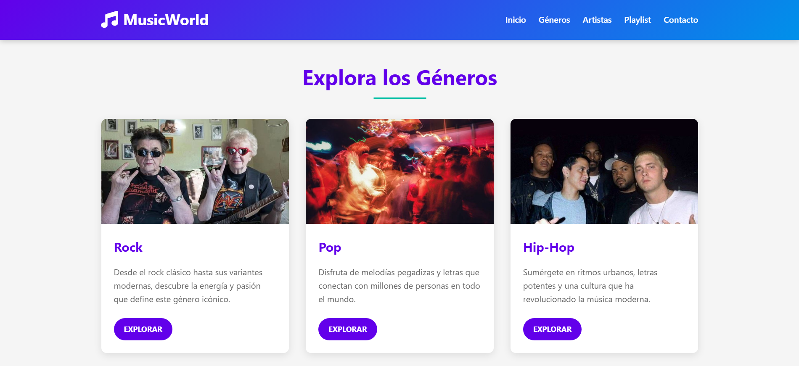
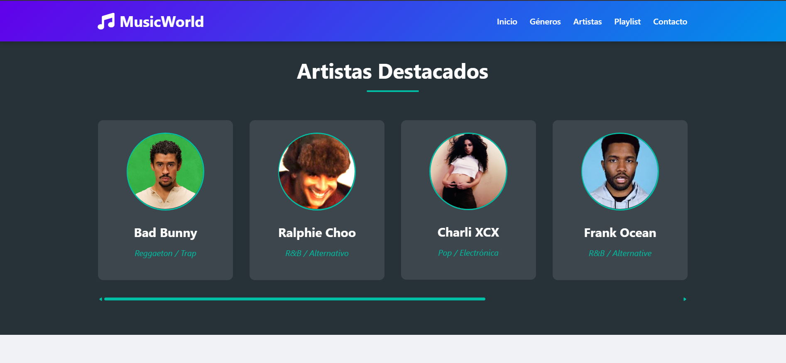
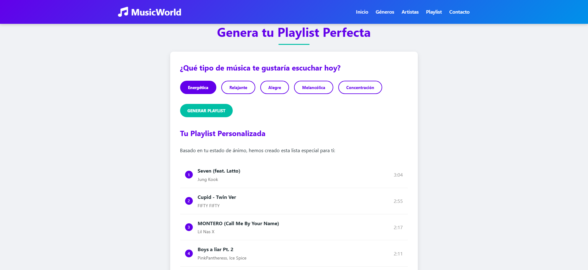
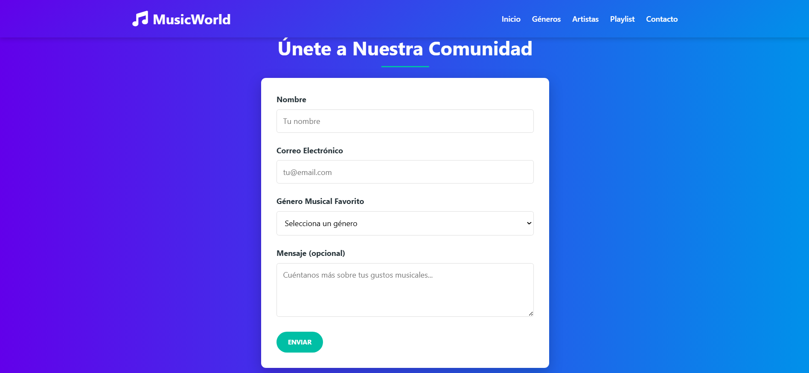
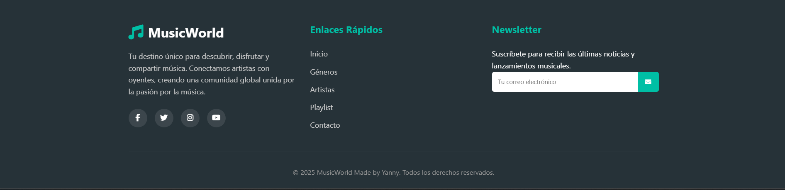

# MusicWorld

MusicWorld es un portal musical desarrollado como proyecto academico para la materia de Programacion V de la Universidad Bicentenaria de Aragua. La aplicacion permite explorar generos musicales, descubrir artistas destacados, generar playlists personalizadas segun el estado de animo del usuario y registrarse en la comunidad.

---

## Vista Previa

### Pagina Principal



### Artistas Destacados


### Generador de Playlist


### Formulario de Contacto


### Footer


---

## Funcionalidades

- Hero section con imagen de fondo y llamada a la accion
- Seccion de generos musicales con tarjetas para Rock, Pop y Hip-Hop
- Slider de artistas destacados generado dinamicamente con JavaScript
- Generador de playlists basado en estado de animo (Energetica, Relajante, Alegre, Melancolica, Concentracion)
- Formulario de registro con validacion de campos en tiempo real
- Newsletter en el footer
- Diseno responsive con navegacion sticky

---

## Artistas Incluidos

| Artista | Genero |
|---|---|
| Bad Bunny | Reggaeton / Trap |
| Ralphie Choo | R&B / Alternativo |
| Charli XCX | Pop / Electronica |
| Frank Ocean | R&B / Alternative |
| Billie Eilish | Pop / Alternative |
| Kendrick Lamar | Hip-Hop / Rap |

---

## Playlists por Estado de Animo

El generador incluye 5 categorias con 5 canciones cada una, mostradas con titulo, artista y duracion.

| Estado de Animo | Ejemplo de cancion |
|---|---|
| Energetica | Seven - Jung Kook |
| Relajante | What Was I Made For? - Billie Eilish |
| Alegre | Flowers - Miley Cyrus |
| Melancolica | Glimpse of Us - Joji |
| Concentracion | Blinding Lights - The Weeknd |

---

## Tecnologias Utilizadas

| Tecnologia | Descripcion |
|---|---|
| HTML5 | Estructura de la pagina |
| CSS3 | Estilos, animaciones y diseño responsive |
| JavaScript | Logica dinamica, DOM y validacion de formularios |
| Font Awesome | Iconografia |

---

## Estructura del Proyecto

```
MusicWorld-Portal/
├── images/
│   ├── badbunny.jpg
│   ├── billie.jpg
│   ├── charli.jpg
│   ├── frank.jpg
│   ├── kendrick.jpg
│   └── ralphie.jpg
├── screenshots/
├── headerpic.jpg
├── hiphop.jpg
├── pop.jpg
├── rock.jpg
├── index.html
├── script.js
└── styles.css
```

---

## Como Ejecutar

El proyecto no requiere instalacion. Abrir el archivo `index.html` con Live Server desde VS Code.

1. Abrir la carpeta en VS Code
2. Clic derecho sobre `index.html`
3. Seleccionar "Open with Live Server"

---

## Autor

Desarrollado por **Yannay Gonzalez** como proyecto academico.
GitHub: [@YannayG](https://github.com/YannayG)
